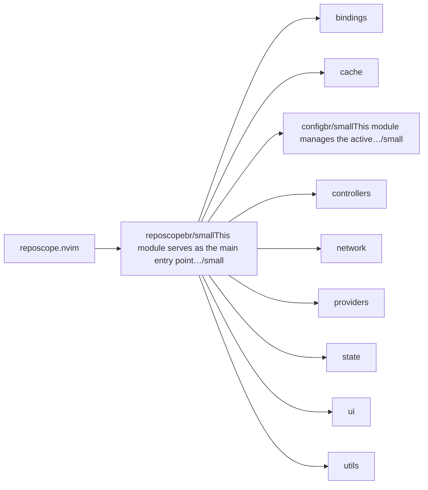
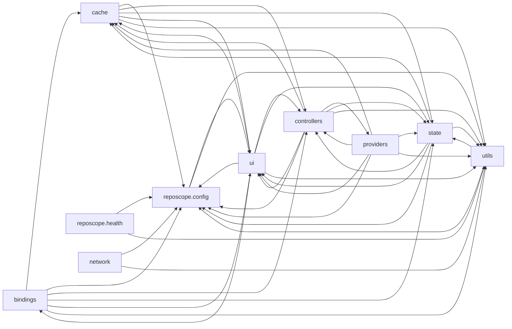

# reposcope.nvim — module map

> **Generated** by `documentation`. Do not edit by hand — run `:DocMap`
> (or `nvim --headless -l scripts/gen_map.lua`) to regenerate.

**5 modules** · 26 namespaces · 95 helper files

The [interactive map](index.html) has filtering, full descriptions and
source links; this page is the version the code host renders directly.

## Namespaces

## Dependencies

Which parts of the tree require which, rolled up to the second level.
The [interactive map](index.html)'s **Deps** view has this per module,
in both directions, with load-time and lazy requires told apart.

## Modules

| Module | Description | Fns | Docs |
|---|---|---|---|
| `reposcope.init` | This module serves as the main entry point for Reposcope’s UI initialization. | 5 | [src](../../lua/reposcope/init.lua) |
| &nbsp;&nbsp;`bindings` |  |  |  |
| &nbsp;&nbsp;`cache` |  |  |  |
| &nbsp;&nbsp;`reposcope.config` | This module manages the active configuration of Reposcope. | 7 | [src](../../lua/reposcope/config/init.lua) |
| &nbsp;&nbsp;`controllers` |  |  |  |
| &nbsp;&nbsp;`network` |  |  |  |
| &nbsp;&nbsp;&nbsp;&nbsp;`clients` |  |  |  |
| &nbsp;&nbsp;&nbsp;&nbsp;`request_tools` |  |  |  |
| &nbsp;&nbsp;`providers` |  |  |  |
| &nbsp;&nbsp;&nbsp;&nbsp;`codeberg` |  |  |  |
| &nbsp;&nbsp;&nbsp;&nbsp;&nbsp;&nbsp;`clone` |  |  |  |
| &nbsp;&nbsp;&nbsp;&nbsp;&nbsp;&nbsp;`readme` |  |  |  |
| &nbsp;&nbsp;&nbsp;&nbsp;&nbsp;&nbsp;`repositories` |  |  |  |
| &nbsp;&nbsp;&nbsp;&nbsp;`github` |  |  |  |
| &nbsp;&nbsp;&nbsp;&nbsp;&nbsp;&nbsp;`clone` |  |  |  |
| &nbsp;&nbsp;&nbsp;&nbsp;&nbsp;&nbsp;`readme` |  |  |  |
| &nbsp;&nbsp;&nbsp;&nbsp;&nbsp;&nbsp;`repositories` |  |  |  |
| &nbsp;&nbsp;&nbsp;&nbsp;`gitlab` |  |  |  |
| &nbsp;&nbsp;&nbsp;&nbsp;&nbsp;&nbsp;`clone` |  |  |  |
| &nbsp;&nbsp;&nbsp;&nbsp;&nbsp;&nbsp;`readme` |  |  |  |
| &nbsp;&nbsp;&nbsp;&nbsp;&nbsp;&nbsp;`repositories` |  |  |  |
| &nbsp;&nbsp;`state` |  |  |  |
| &nbsp;&nbsp;&nbsp;&nbsp;`ui` |  |  |  |
| &nbsp;&nbsp;`ui` |  |  |  |
| &nbsp;&nbsp;&nbsp;&nbsp;`actions` |  |  |  |
| &nbsp;&nbsp;&nbsp;&nbsp;`background` |  |  |  |
| &nbsp;&nbsp;&nbsp;&nbsp;`reposcope.ui.list.list_ui` | This module acts as the orchestration layer for the repository list UI. | 1 | [src](../../lua/reposcope/ui/list/init.lua) |
| &nbsp;&nbsp;&nbsp;&nbsp;`reposcope.ui.preview.init` | @brief Initializes the preview window and injects the startup banner @description This module sets up the preview window as part of the Reposcope UI. | 1 | [src](../../lua/reposcope/ui/preview/init.lua) |
| &nbsp;&nbsp;&nbsp;&nbsp;`reposcope.ui.prompt.init` | This module initializes the full prompt UI. | 1 | [src](../../lua/reposcope/ui/prompt/init.lua) |
| &nbsp;&nbsp;`utils` |  |  |  |

## Drift

9 errors · 32 warnings · 15 info

| Severity | Check | Message |
|---|---|---|
| error | `module-path-mismatch` | lua/reposcope/init.lua declares @module 'reposcope.init' but lives at 'reposcope' |
| error | `module-path-mismatch` | lua/reposcope/network/clients/api_client.lua declares @module 'reposcope.network.api_client' but lives at 'reposcope.network.clients.api_client' |
| error | `module-path-mismatch` | lua/reposcope/network/request_tools/curl.lua declares @module 'reposcope.network.request_tools.curl_request' but lives at 'reposcope.network.request_tools.curl' |
| error | `module-path-mismatch` | lua/reposcope/ui/list/init.lua declares @module 'reposcope.ui.list.list_ui' but lives at 'reposcope.ui.list' |
| error | `module-path-mismatch` | lua/reposcope/ui/preview/init.lua declares @module 'reposcope.ui.preview.init' but lives at 'reposcope.ui.preview' |
| error | `module-path-mismatch` | lua/reposcope/ui/prompt/init.lua declares @module 'reposcope.ui.prompt.init' but lives at 'reposcope.ui.prompt' |
| error | `module-path-mismatch` | lua/reposcope/ui/prompt/prompt_buffers.lua declares @module 'reposcope.ui.prompt.prompt_bffers' but lives at 'reposcope.ui.prompt.prompt_buffers' |
| error | `module-path-mismatch` | lua/reposcope/utils/stats.lua declares @module 'reposcope.ui.stats' but lives at 'reposcope.utils.stats' |
| error | `module-path-mismatch` | lua/reposcope/utils/text.lua declares @module 'reposcope.utils.text_utils' but lives at 'reposcope.utils.text' |
| warn | `dead-see-target` | M.build: @see target 'reposcope.providers.github.query_builder.M.build' does not resolve to a known module or function |
| warn | `dead-see-target` | M.build: @see target 'reposcope.providers.gitlab.query_builder.M.build' does not resolve to a known module or function |
| warn | `dead-see-target` | M.fetch_for_selected: @see target 'reposcope.providers.gitlab.readme.readme_manager.M.fetch_for_selected' does not resolve to a known module or function |
| warn | `dead-see-target` | M.fetch_for_selected: @see target 'reposcope.providers.github.readme.readme_manager.M.fetch_for_selected' does not resolve to a known module or function |
| warn | `dead-see-target` | M.fetch: @see target 'reposcope.providers.gitlab.repositories.repository_manager.M.fetch' does not resolve to a known module or function |
| warn | `dead-see-target` | M.fetch: @see target 'reposcope.providers.github.repositories.repository_manager.M.fetch' does not resolve to a known module or function |
| warn | `dead-see-target` | M.build: @see target 'reposcope.providers.codeberg.query_builder.M.build' does not resolve to a known module or function |
| warn | `dead-see-target` | M.build: @see target 'reposcope.providers.gitlab.query_builder.M.build' does not resolve to a known module or function |
| warn | `dead-see-target` | M.fetch_for_selected: @see target 'reposcope.providers.codeberg.readme.readme_manager.M.fetch_for_selected' does not resolve to a known module or function |
| warn | `dead-see-target` | M.fetch_for_selected: @see target 'reposcope.providers.gitlab.readme.readme_manager.M.fetch_for_selected' does not resolve to a known module or function |
| warn | `dead-see-target` | M.fetch: @see target 'reposcope.providers.gitlab.repositories.repository_manager.M.fetch' does not resolve to a known module or function |
| warn | `dead-see-target` | M.fetch: @see target 'reposcope.providers.codeberg.repositories.repository_manager.M.fetch' does not resolve to a known module or function |
| warn | `dead-see-target` | M.build: @see target 'reposcope.providers.github.query_builder.M.build' does not resolve to a known module or function |
| warn | `dead-see-target` | M.build: @see target 'reposcope.providers.codeberg.query_builder.M.build' does not resolve to a known module or function |
| warn | `dead-see-target` | M.fetch_for_selected: @see target 'reposcope.providers.github.readme.readme_manager.M.fetch_for_selected' does not resolve to a known module or function |
| warn | `dead-see-target` | M.fetch_for_selected: @see target 'reposcope.providers.codeberg.readme.readme_manager.M.fetch_for_selected' does not resolve to a known module or function |
| warn | `dead-see-target` | M.fetch: @see target 'reposcope.providers.github.repositories.repository_manager.M.fetch' does not resolve to a known module or function |
| warn | `dead-see-target` | M.fetch: @see target 'reposcope.providers.codeberg.repositories.repository_manager.M.fetch' does not resolve to a known module or function |
| warn | `require-not-declared` | requires "reposcope.ui.list.init" (line 35), which no file in this tree declares |
| warn | `require-not-declared` | requires "reposcope.utils.stats" (line 155), which no file in this tree declares |
| warn | `require-not-declared` | requires "reposcope.utils.text" (line 19), which no file in this tree declares |
| warn | `require-not-declared` | requires "reposcope.network.request_tools.curl" (line 14), which no file in this tree declares |
| warn | `require-not-declared` | requires "reposcope.network.clients.api_client" (line 13), which no file in this tree declares |
| warn | `require-not-declared` | requires "reposcope.network.clients.api_client" (line 14), which no file in this tree declares |
| warn | `require-not-declared` | requires "reposcope.network.clients.api_client" (line 15), which no file in this tree declares |
| warn | `require-not-declared` | requires "reposcope.network.clients.api_client" (line 13), which no file in this tree declares |
| warn | `require-not-declared` | requires "reposcope.network.clients.api_client" (line 13), which no file in this tree declares |
| warn | `require-not-declared` | requires "reposcope.network.clients.api_client" (line 18), which no file in this tree declares |
| warn | `require-not-declared` | requires "reposcope.utils.text" (line 25), which no file in this tree declares |
| warn | `require-not-declared` | requires "reposcope.utils.text" (line 12), which no file in this tree declares |
| warn | `require-not-declared` | requires "reposcope.ui.prompt.prompt_buffers" (line 29), which no file in this tree declares |
| warn | `require-not-declared` | requires "reposcope.network.clients.api_client" (line 306), which no file in this tree declares |

15 informational findings

| Check | Message |
|---|---|
| `missing-readme` | lua/reposcope has no README.md |
| `missing-readme` | lua/reposcope/config has no README.md |
| `missing-readme` | lua/reposcope/ui/list has no README.md |
| `missing-readme` | lua/reposcope/ui/preview has no README.md |
| `missing-readme` | lua/reposcope/ui/prompt has no README.md |
| `undocumented-param` | M.set_dev_mode has 1 parameter(s) but only 0 @param line(s) |
| `undocumented-param` | M.is_dir_writeable has 1 parameter(s) but only 0 @param line(s) |
| `undocumented-param` | M.is_valid_filename has 1 parameter(s) but only 0 @param line(s) |
| `unreferenced-module` | reposcope.health is required by no other file in the tree |
| `unreferenced-module` | reposcope.network.api_client is required by no other file in the tree |
| `unreferenced-module` | reposcope.network.request_tools.curl_request is required by no other file in the tree |
| `unreferenced-module` | reposcope.ui.list.list_ui is required by no other file in the tree |
| `unreferenced-module` | reposcope.ui.prompt.prompt_bffers is required by no other file in the tree |
| `unreferenced-module` | reposcope.ui.stats is required by no other file in the tree |
| `unreferenced-module` | reposcope.utils.text_utils is required by no other file in the tree |

